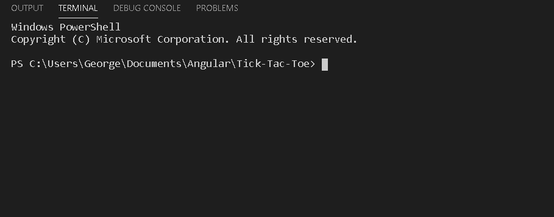

# Tic Tac Toe made with Angular


     


Tic-tac-toe, noughts and crosses, or Xs and Os is a paper-and-pencil game for two players,
X and O, who take turns marking the spaces in a 3×3 grid. The player who succeeds in placing
three of their marks in a horizontal, vertical, or diagonal row is the winner. This project is attempting to simulate tic tac toe UI and logic using Angular and other tools. **See more below**.


### Prerequisites

* [Node.js](https://nodejs.org/en/)
* [Angular CLI](https://github.com/angular/angular-cli) version 9
* [npm package manager](https://www.npmjs.com/)
* [Visual Studio Code](https://code.visualstudio.com/) (optional)


## Deployment

Use `cd` to navigate to the project folder

Use `npm install` to install node modules

Run `ng serve` for a dev server. Navigate to `http://localhost:4200/`. The app will automatically reload if you change any of the source files.




## More options

Run `ng generate component component-name` to generate a new component. You can also use `ng generate `

Run `ng build` to build the project. The build artifacts will be stored in the `dist/` directory. Use the `--prod` flag for a production build.

Run `ng test` to execute the unit tests via [Karma](https://karma-runner.github.io).

Run `ng e2e` to execute the end-to-end tests via [Protractor](http://www.protractortest.org/).

To get more help on the Angular CLI use `ng help` or go check out the [Angular CLI README](https://github.com/angular/angular-cli/blob/master/README.md).

## FAQ
If you are getting a list of errors on `npm install` that look like `Cannot find name 'Promise'`, check your `package.json` file and see if the following DevDependencies have a caret in front of the version number (the ^ symbol):
```json
"devDependencies": {
  
  "@types/core-js": "0.9.34",
  "@types/node": "6.0.41"
  
}
```
If the caret is there (would look like `"@types/core-js": "^0.9.34"`) then remove it (or copy the contents of the [package.json](https://github.com/GorgonUK/Tic-Tac-Toe/blob/master/package.json) file on the origin repository) and run `npm install` again.

## Built With

* [Angular](https://angular.io/) - JavaScript Framework
* [Webpack](https://webpack.js.org/) - JavaScript module bundler
* [Node.js](https://nodejs.org) - JavaScript runtime environment

